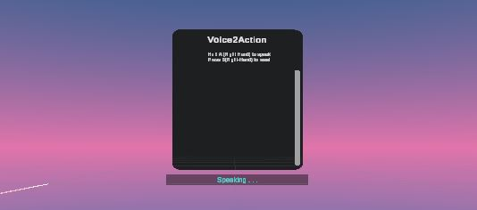
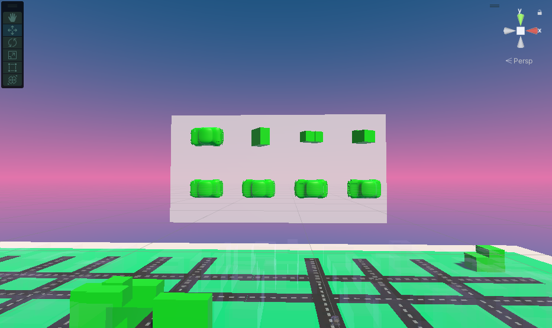
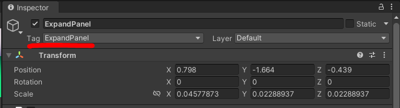
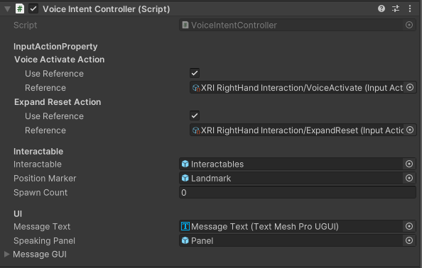

# Voice to Action - Expand Interaction with LLMs
 
## Overview
This Unity package combines an "Expand" interaction technique with the combination of voice-based NLP to create an innovative selection mechanism for enhanced user experiences. 

By incorporating this package into your VR project, you can use voice commands to filter through multiple objects, creates smaller, scaled-down versions of the original object called "proxy objects", and brings the proxy objects into view. When you hover over the proxy object, it will show the user the information of the original object. A raycast will also show the user where the object is located. 
## Package contents	
**Runtime**
In the Runtime folder, you can find a list of scripts that are used in this package. 
There are several scripts that need to be understood in order to utilize this package. 

1. ExpandPanel.cs - Attach this script to a GameObject where you want to call objects onto. Objects that you wish to call will be shown on this panel. 
2. VoiceIntentController.cs - User needs to configure the "Interactable" Serializable field. In order for the package to detect which objects are "interactable" - meaning which objects can be filtered through and called - these "interactable" objects need to be grouped together under the same parent in the Scene Hierarchy. This is what we call the "Interactables" group object. This parent game object, or group, must be attached to the VoiceIntentController script by serializing it in the Interactables Seraializable field. 

**Sample**
This folder holds a sample scene called "CityDemo" with the package implemented inside the scene. 

## Installation instructions
1. Go to Windows > Package Manager and click the "+" button on the left-hand corner. Select "Add package through git URL." Add [this GitHub Repository Link](https://github.com/xrc-students/xrc-students-fa2023-sp06-en268_jx288_ys724.git) into the URL field. 
    a. (Optional) In the Samples tab, you can import the CityDemo to see a sample scene of the usage of our package. 
2. Inside the Package Manager, look for the XR Interaction Toolkit Package. In the Samples tab, install "Starter Assets" and "Device Simulator." 
3. In order to utilize the core features, we need to install the OpenAI package. Go to [the Open UPM package](https://openupm.com/packages/com.openai.unity/) and follow the instructions to download OpenAI UPM. 
4. In Package Manager > My Registries > OpenAI > Version History tab, check to see that you have downloaded OpenAI version "5.0.11." If not, click update to this version. 
5. Restart Unity to properly configure Unity and OpenAI settings. 
6. Create a folder in the Assets folder titled "Resources". Inside the folder, right click and select Create > OpenAI > OpenAIConfigurations. Enter your API key and your organization ID from your OpenAI API user settings. 

## Requirements	
Uses Unity Version 2022.03
OpenAI UPM version 5.0.11
Must have OpenAI credentials 

## Workflows	
**Interactables** 
All of the interactable objects should be grouped under a parent game object. 
 
Currently, the objects should be grouped into these specific names [Buildings, Cars, Streets, Trees, MiniBuses, SchoolBuses]. 
  **Landmark** 
  
Landmark is used when you want to call objects located in a specific area. Our example used streets to exemplify this. 

For example, if you want to call an object near "Main Street", you must specify with an object where the boundaries of "Main Street" is. 
In this scene, when the user calls for objects near Main Street, it will call all the objects that are near this strip of land.
  **InfoPanel** 

The Info panel stores the information of the object that is being highlighted over in the expand panel.  

  **Voice2Action GUI**  

 

Inside the Samples folder (if you have imported the optional CityDemo sample) you will see a prefab called "Voice2ActionGUI". This prefab is the text panel that holds the history of speech messages between the user and the AI model. 
While this is not a required feature, if you wish to have a speech to text interface please look at "VoiceIntentController" section below for more information on setting up the Voice2Action GUI for your project.
  **ExpandPanel**  
 
The Expand Panel is used to store the objects you've called that will be "expanded" in front of you. 
When you highlight over an object that is presented to you in the expand panel, it will show a raycast indicating the location of the object as well as general information of the object.
 
In order to use an expand panel, set the tag for the game object that you wish to expand to to "ExpandPanel."

  **VoiceIntentController** 
This script is the bridge between user and the AI natural language processing model.
 
First, connect the VoiceActivateAction to "XRI RightHand Interaction/VoiceActivate." Second, connect the XRI RightHand Interaction/Expand Reset Action to the Expand Reset Action reference.
 

Next, connect your Interactables Game Object and Landmarks Game Object into the Interactable field and the Position Marker field, respectively.

The UI field is where you will connect the text from the Voice2ActionGUI. 
Connect the text component from your VoiceIntentControllerGUI - this will store the entire history of messages that the user exchanged with the AI assistant.
The Speaking panel is a panel under the VoiceIntentControllerGUI that will show up when the Voice Activate Action is enabled. 
Thus, it will show up when the user presses the primary button and starts speaking into the mic.
  **SceneManager** 
 

The Scene Manager handles all of the other components inside the scene. Attach your left and right ray interactors with their specified fields. Attach the XR Origin Main Camera to the XR Origin Camera field and finally attach the InfoPanel to the ShapeInfo Panel field. The ObjectScale value indicates how big you want the objects that are expanded into view to be.
Include a list of steps that the user can easily follow that demonstrates how to use the feature. You can include screenshots to help describe how to use the feature.

## Samples
Inside the Samples folder, we have a sample scene called CityDemo with the package implemented inside the Scene. 
This scene uses an urban planning environment to call different buildings, cars, trees, etc. in different locations / streets.