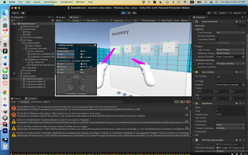

# VR-Multimodal-Interaction

XR provides a clear value proposition for 3D design applications, such as industrial design, mechanical engineering, and urban design. This project explores multimodal interaction techniques for improving productivity in virtual reality creator tools.

# Milestones

## Screenshots

### Interact with [Arkio](https://www.arkio.is/)

### Inventory System

### MRTK3 with Figma

## Voice2Action

### v1: with [OpenAI API](https://openai.com/blog/openai-api)

https://drive.google.com/file/d/1aBnFjKaf-YRXj5mlfzjCzcBiivHBB9JC/view?usp=sharing

### v0: with [Wit.ai](https://wit.ai/)

https://youtu.be/bS-PrmOSAVc

## Expand

### with Inventory

- To Add

### with Voodoo

https://youtu.be/txuVBk85-gA

# Progress

## March 17, 2023

### Accomplishments

For the past two weeks, there are three major accomplishments.
- Yang successfully implemented a function prototype of voice interaction in unity. The module is capable of translating a user’s voice input to a certain action performed on a certain object. For example, “move the leftmost cube to right” will be translated to a movement function on the leftmost cube, and it will move it to the right.
- We decided to make a creativity support tool which focuses on urban planning scenarios which involve super dense object placement, and a lot of selection and manipulation.
- Refinement of the expand interaction, we added extra features to the expand method to make it more suitable for urban planning tools, including voodoo dolls, transparent voodoo objects, and UI for the voodoo objects.

### Challenges

Oculus integration SDK, it is super messy, and hard to configure on a different machine, so right now, we can only develop SDK related content on Yang’s computer.
Visual feedback on expand, we are concerned that the current expand lacks visual affordance. The users might be confused when all objects fly towards the users.

### Going Forward

Refine voice interaction. Fix the reference axis, so that the left and right are based on the user's position.
Expand method refinement. Make sure the voodoo disappears, and make the voodoo object transparent.
Design new features to improve affordance on the expand.
Combine expand with voice interaction.

## March 03, 2023

### Accomplishments

As discussed in the previous week, we explored all the components in MRTK3. We extracted UI objects that we intend to use inside our project, successfully replicated some of its main interaction features, and using the acquired information, wireframes a basic concept for multio-modal interaction.  We consolidated the idea that we will use Expand interaction with voice input and a better inventory system that provides users with a better way to visualize and filter out items. 

We also implemented the basic functionalities of recognizing speech input from users to interact and modify states of any 3D objects in the virtual scene. A demo video showcasing the result is available here: [Voice2Action V0](https://youtu.be/bS-PrmOSAVc)

We call this prototype “Voice2Action”, suggesting that it lets the user to use voice commands to support and facilitate interaction. Currently, the user can change the object’s static properties with customized inputs, including colors, shapes and locations. The inputs are customizable in a way that no keywords like “select A, B and C” or “change the shape of X, Y and Z” are needed. Instead, the machine learning model on the cloud, wit.ai, will recognize the action that the user intends to perform and trigger user-defined functions that call to modify the states of the objects.

### Challenges

[MRTK3 challenges] it is expended 🙂 so we can not really rely heavily on its framework but can use it as a guide line of how we should design our codes, also it has some useful UIs that we can borrow to make our implementation easier to understand and interact with.

Currently, the “Voice2Action” prototype can only support a fixed number and type of entities (shape, color, location). If we want to modify any states and the objects’ interaction with other objects (i.e. put object A on top of object B), then we need some ways to separate out the commands for selecting, interacting and state modification, which requires a solid understanding of both the machine learning natural language framework and how Unity deals with object state updates. This will be gradually trackled by starting from building pipelines to support interaction with infinitely many objects instead of a fixed number of them.

### Going Forward

- Grace : Want to get Prototyped view on Figma 
  - Work on Unity Scene with Virtualized Scroll List + Object Bar 
- Steven: Create shallow duplicates by expanding and can manipulate them closely
- Yang: make Voice2Action work on arbitrary number of objects, right now only supports fixed number of input types (shape + color, shape + position, shape + rotation)
- Quick To Dos: try shapesXR
- Future: Combine Voice2Action and Expand
  - Use Voice2Action to select arbitrary numbers of objects with users’ intent
  - Support Voice2Action on the shallow duplicates as well
- To Dos
  - Learn how MRTK3 works and read their codes/documentation when we are building our functionalities with XRI
  - Try gaze and hand tracking with the new XRI release
- Aside: try out the DALLE-2 with Wit and think about how that can be better incorporated into our current design

## Feb 17, 2023

### Accomplishments

For the previous week, we read papers relevant to multimodal interaction. We mostly focused on gaze interaction and how we can implement that mode of input into interaction in a VR setting. We browsed through some papers, and links are on the Research Gathered section. For this week, we ideated different multimodal methods more concretely. 
More specifically, we built upon the idea of a selection and manipulation technique called “Expand.” Jingxe came up with an idea that explored upon creating more precise selection for Expand using UI inventory while Grace came up with the idea to filter out selection using Audio input. Yang worked on actually implementing machine learning models into Unity.

### Challenges

The modalities we are working on to get into the VR scene includes hand tracking, eye gaze tracking and voice recognition. 

Hand tracking is a future work TODO for now.

Eye gaze tracking is not supported in XRI yet, but do exists in MRTK3, so we probably need to get MRTK3 working to get started on this modality, also MRTK3 provides a lot of great sample scene to get started with, hence we will all be trying out MRTK3 this week and see what work/does not work. Since the MRTK3 team is disbanded, we need to be careful in implementing things that require MRTK3 as the backend.

Voice recognition can be implemented with the Wit.ai toolkit. Yang mainly did this part the previous weeks. The goal is to manipulate the static and dynamic features of Unity objects. By static, we mean the properties of the objects themselves, such as shape, color, distance, textures, etc. The underlined part is known to be implemented by the Wit.ai toolkit already, so we need to figure out how they did that. By dynamic, we mean the events triggered on the object we are interacting with can be manipulated through voice input. The basic functionality of this is also implemented in Wit.ai, and we will extend on that in the future. Lastly, Wit.ai is currently not compatible with Oculus Integration v49.0, but works on v47.0, so if there are new features coming out in Oculus Integration, we need to find some way to get it working in the latest release.

### Going Forward

After our weekly meeting with Harald, we are going to be exploring MRTK3 toolkit on the Quest Pro. While Yang works more deeply with voice detection & machine learning in VR. Steven and Grace will focus on implementing the interaction for Expand. 

## Research Resources

We’ve found out through looking through some tutorials on the Quest Pro, that Gaze Interactor (which was the potential mode of input that we were looking into) was not fully supported by XRI toolkit. We also perused the following papers for more information on Gaze Interaction : 

- Pfeuffer, Ken, “Gaze-Shifting: Direct-Indirect Input with Pen and Touch Modulated by Gaze.”
- Mesh Walker
- Ken Pfeuffer: Gaze+ Pinch Interaction in Virtual Reality
- Brendan David-John: Gaze-based prediction of the intent to interact in VR

We also looked into VR tutorials for Gaze Interactor. 
- https://www.youtube.com/watch?v=ZoySn7QlMfQ https://www.youtube.com/watch?v=2xWhBKn7Wp0
- https://www.youtube.com/watch?v=gv4tFxJ0vyU
- https://www.youtube.com/watch?v=gWFOw_yb9vY 
