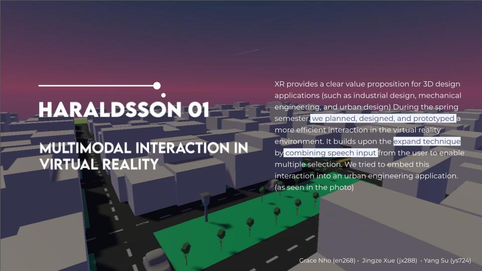
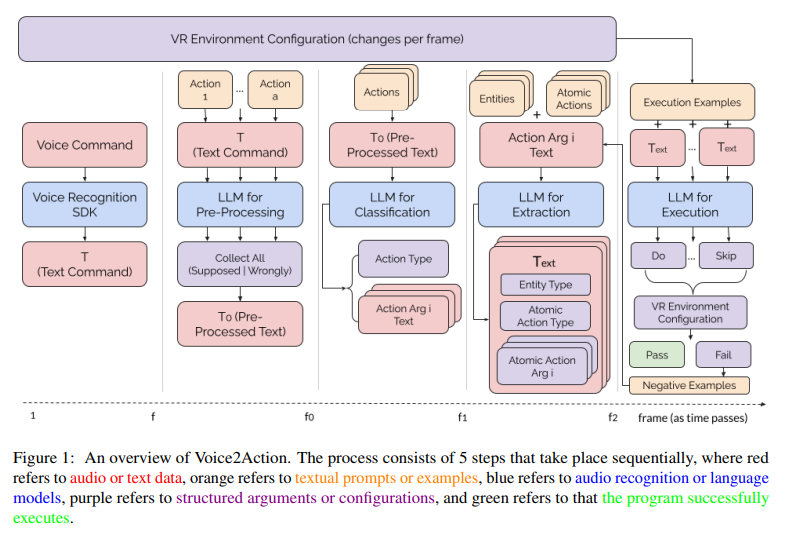
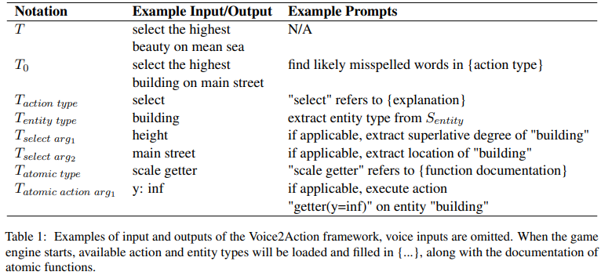
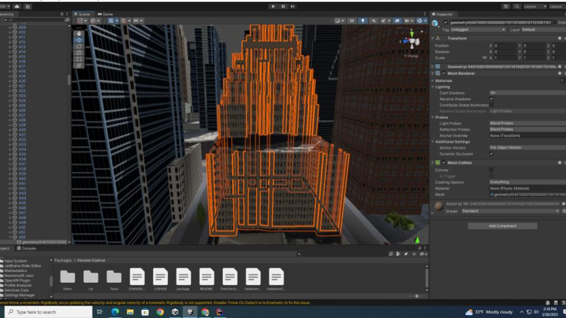
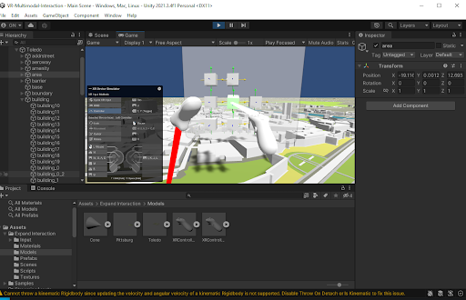
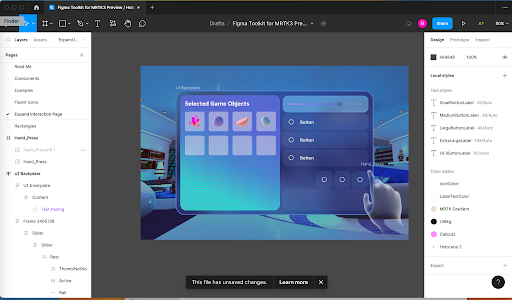

# VR-Multimodal-Interaction

XR provides a clear value proposition for 3D design applications, such as industrial design, mechanical engineering, and urban design. This project explores multimodal interaction techniques for improving productivity in virtual reality creator tools.

## Demo

[Voice2Action](https://drive.google.com/file/d/159XWeBlK_tdkoEv76xrA5s78dy4UEPfS/view?usp=sharing)

## Milestones

### Screenshots

- VR Multimodal Interaction in City Planning

- Voice2Action Hirerachy

- Voice2Action Example

<!-- - Industrial Prototype Engineering

- Interact with [Arkio](https://www.arkio.is/)

- MRTK3 with Figma

 -->

### Video

- [Term 1 Final](https://drive.google.com/file/d/124bYdC-xJdPBfnGoTMYzD3i7H-uv6LQy/view?usp=sharing): Entity Selection and Expand in Industrial Design

- [Voice2Action v1](https://drive.google.com/file/d/1aBnFjKaf-YRXj5mlfzjCzcBiivHBB9JC/view?usp=sharing): with [OpenAI API](https://openai.com/blog/openai-api)

- [Voice2Action v0](https://youtu.be/bS-PrmOSAVc): with [Wit.ai](https://wit.ai/)

- [Expand with Proxy](https://youtu.be/txuVBk85-gA)

## Paper - Voice2Action

- [Here](https://drive.google.com/file/d/1MIPDtJ5SR1e9J4PD2kWg70Zu_v8qyk7H/view?usp=sharing).

**Abstract**

Large Language Models (LLMs) are trained and aligned to follow natural language instruc003 tions with only a handful of examples, and they are prompted as task-driven autonomous agents to adapt to various sources of execution envi006 ronments. However, deploying agent LLMs in virtual reality (VR) has been challenging due to the lack of efficiency in online interac009 tions and the complex manipulation categories in 3D environments. In this work, we propose Voice2Action, a framework that hierarchically analyzes customized voice signals and textual commands through action and entity extraction and divides the execution tasks into canonical interaction subsets in real-time with error pre016 vention from environment feedback. Experiment results in an urban engineering VR environment with synthetic instruction data show that Voice2Action can perform more efficiently and accurately than approaches without optimizations.

## Spring Report

### Combining the “Expand” Interaction with Large Language Model to Create More Effective Means of Selection and Manipulation

**Abstract**

XR provides a clear value proposition for 3D design applications, such as industrial design, mechanical engineering, and urban design. Our project explores multimodal interaction techniques for improving productivity in virtual reality creator tools. We used the “expand interaction”, an interaction that expands multiple objects into the user's view, with user speech input so that the users can effectively call objects of their interest from any location into their reach. We've tried extending our project to an urban engineering setting where the user (or in this case, an urban engineer) can call up multiple buildings of interest to a panel, inspect them, and get information about the building. It can also be used to call / select objects that are far away from the user's reach. 

For the Fall-Semester, we want to work on refining our user interface/user interaction/ and user experience with our multimodal interaction. In the fall, we will implement the information panel, a panel that brings up information about the object, and a locomotion technique. By the end of the Fall semester, we want to have a multi-modal interaction that is proved to be efficient and improve selection especially in the context of multiple object selection. We also want to gauge user interaction in the context of speech commands (which commands are most frequently used, what commands are the most accurate and the most faulty ? , etc.) 

Our work, if carried out with success, has many merits. First off, it may be the first to implement selection with speech recognition in virtual reality. This area of research can possibly pave ideas into the combination of natural language processing and user interaction, not just in the domain of selection. (We have also experimented with ways to manipulate objects in the virtual environment by using speech recognition. Just an idea for possible future projects) 

Second, we are implementing an easier mode of selection. The first implementation of expand expands every object into perspective  , which is inefficient for users who are looking for a single specific game object. With the combination of speech input, the user can filter out the objects before presenting it to view without having to redundantly select or overuse the inputs on the controllers.

Third, we are providing another efficient mechanism in multiple object selection. Currently, many creative support tools can only select multiple objects that are close to them and are closely clustered around each other. With this multimodal selection mechanism, we can bring in objects that are from different locations and are out of reach. This is especially useful when you want to bring in game objects that are located at far ends and place them next to each other to compare them side by side. 

We hope that our work in this field can open up more exploration and ideas into how speech input and natural language processing can be utilized inside a virtual reality context to provide efficiency and accuracy in selection. This multimodal interaction can be utilized in many different settings, but most effectively in creative support tools for virtual reality and augmented reality. Many creative support tools in VR (Gravity Sketch, Frame.io, Arkio) do not have a mechanism where you can call multiple objects from different locations. If you want to look at , edit, or manipulate an object, you need to be in physical reach of the item. This implementation can potentially impact how we can utilize and manipulate objects inside the virtual world. While it might not be an ideal situation to bring every single item in the scene into view, if the mechanism had distance regulations and restrictions, for example, only bringing and filtering objects that are 2 to 3 meters away from the user, then it would be extremely efficient. 

There is an immense amount of work to do to improve user experience in the virtual reality field and our project would be a step into making VR more usable.

**Background**

One of the most exciting aspects of VR technology is the potential for natural and intuitive interactions with virtual objects and environments. Speech input, which allows users to interact with virtual objects and environments using spoken commands, is one of the most promising modalities for enabling such interactions. Speech input can be used to issue commands to the system, control objects, and provide feedback, creating a more immersive and intuitive experience for users.

Speech input has been used in virtual environments for various applications, such as gaming, education, and therapy. In gaming, speech input has been used to enable players to  issue commands to NPCs, and navigate through environments. In education, speech input has been used to create immersive and interactive learning environments that provide a more engaging and personalized experience for students. 

Despite the challenges, speech input holds great promise for the future of VR technology. As VR becomes more ubiquitous and the technology continues to evolve, it is likely that speech input will play an increasingly important role in enabling more natural, intuitive, and immersive interactions with virtual environments and objects. In our interaction, we chose to use speech input to select objects.

We mostly utilized Laviola's book "3D User interfaces Theory and Practice" Second edition. This book highlighted a lot of selection interaction methods that were implemented. We also looked into many different papers (listed below) and different Unity tutorials, mostly research articles from Brendan David-John and Ken Pfeuffer.  While these two researchers mostly focused on using gaze as another mode of input, it gave as a lot of insight into how we can mold multiple modes of interaction to create an interaction for better user experience. 

Previous research has been done by Koons and Sparrell in 1994, where they combined gestures and speech input to explore multimodal input in 3D graphics environments. Their two haptic gloves allowed users to arrange 3D objects in a scene. Another research that was conducted was in an augmented reality and combined 3D natural hand gesture and speech input. There have been multiple efforts to combine speech with multimodal interactions, however there have been none that have explored the regime of speech input with selection. 

**Spring Learnings**

Before we jumped into prototyping and implementing the expand interaction, we dove into recommended papers and literature reviews from our advisor. We also looked into the 3D User Interfaces book to explore different ideas. We initially wanted to combine gaze interaction with a selection mechanism, but with the current technology frame that we had to work with, we resorted to speech and sound input. We explored all the components in MRTK3, replicated some of its main interaction features, and wireframed a basic concept for multimodal interaction. We ended up consolidating on the idea of using “Expand” interaction with voice input and combining that to create a better accessing system that provides users a better way to visualize and filter out items. Through this we learned about existing interactions, mechanisms, and different tools (MRTK3, Procedural City Generator, Blender, etc. ) that are available to us for use.

We call our prototype "Voice2Action". It lets the user use voice commands to support and facilitate interaction. Currently, the user can change the object's static properties with customized inputs, including colors, shapes, and locations. The inputs are customizable in a way that no keywords like "select A, B and C" or "change the shape of X, Y and Z" are needed.
We came across a difficulty here because we then had to think of frequently used commands users would go to. 

We later successfully implemented a function prototype of voice interaction in unity. The module can translate a user's voice input to a certain action performed on a certain object. For example, "move the leftmost cube to the right" will be translated to a movement function on the leftmost cube, and it will move it to the right. We also decided to expand this to a ceativity support tool that focuses on urban planning scenarios involving super-dense object placement and a lot of selection and manipulation. The expand interaction was then refined and extra features were added to make it more suitable for urban planning tools, including voodoo dolls, transparent voodoo objects, and UI for the voodoo objects. We encountered a lot of challenges with the Oculus integration SDK, which is messy and hard to configure on a different machine, so they can only develop SDK related content on one computer. We learned how to work around that.

As all teams do, we also had our fair share of learning how to collaborate with one another. We learned a lot on how to communicate deliverables and expectations between each other and we expect this to be of great help to us in the long run of our SPEC project next semester. 

**Major Milestones**

The first and major milestone for us is to refine User Interaction and User Interface of the Expand + Speech Recognition Interaction. This includes, as aforementioned, creating an information panel that exemplifies what you can do with this voice input & expand multimodal interaction. The second is a locomotion action that lets you move inside of the scene.  If we deem to have enough time, we will also add an interface for a second filter that will filter out the selected objects in the expand panel after the first filter or first selection. If we decide to add the second filter, it will add one more week to our intended plan. To play it safe, we will allocate three weeks to one month of our time for this milestone. 

We also need to use prep for user studies for our interaction. This includes creating prompts, creating tasks, and recruiting users for our user studies. We also want to look into potential conferences where we can showcase our interaction. This should take us at maximum two weeks. 

After prepping for user studies, we must conduct multiple user studies. We first want to do it with 5 to 10 people before we actually go into studying the effectiveness of our interaction. This is so that we can aggregate user feedback from these people and reiterate on the design & implementation process. This should take us an additional 2 weeks. 

After our iteration is complete, we need to finally conduct user studies. We will like to do this with potentiall 10 - 20 more people. This should take us two to three weeks. It may even take us more time depending on schedule conflicts with the users. 

After conducting all of our user research, comparing results, and analyzing them, we intend to write a paper for a small conference or a poster. This should be our last remaining task and this will take up the remainder of the semester, or until paper submission. 

## Progress

### April 21, 2023

**Accomplishments**

For the past two weeks we have two accomplishments:
- We added fade in and fade out effects to our scene.
- We also optimized our scene better for rendering ⇒ Current scene is too heavy to render and so we looked for alternative ways to render our scene view. 

**Challenges**

Yang is still working on trying to integrate it so that the project does not have any more bugs. 
We have trouble finding good city assets that will match our needs. 
We also have a little trouble moving our SDK into our expand project.

**Going Forward**

We are going to optimize the city scene so that we have better rendering and better game play. 
We need to combine Yang’s Voice2Action with our Expand interaction. 
We need to refine our user interaction 

### March 31, 2023

**Accomplishments**

For the past two weeks, there are three major accomplishments.
- Yang successfully implemented Voice 2 Action and now it can select any entity’s property based on their color, shape, and position. It also completely bypassed wit.ai as wit.ai is constrained by the number of properties to manipulate. 
- Steven refined the interaction so that the panel now gets rid of duplicate objects when an object is reselected, added line-renderes so that users can now understand where the object is pointing to, and you can also manipulate the object. 
- Grace worked on the panels and created two different ones : a scroll panel and a panel that expands and changes width dynamically. 

**Challenges**

Oculus integration SDK is very messy and Yang is working on trying to integrate it so that the project does not have any more bugs. 
Our New York city asset is too big.

**Going Forward**

We are going to create a more defined task description so that we don’t get confused about our task ahead. 
We are going to optimize Yang’s implementation of using NLP and debug it. 
We are going to optimize the New York city 3D object. 
We are also going to work on final steps on refining the expand by combining Yang’s features into our expand panel. 

### March 17, 2023

**Accomplishments**

For the past two weeks, there are three major accomplishments.
- Yang successfully implemented a function prototype of voice interaction in unity. The module is capable of translating a user’s voice input to a certain action performed on a certain object. For example, “move the leftmost cube to right” will be translated to a movement function on the leftmost cube, and it will move it to the right.
- We decided to make a creativity support tool which focuses on urban planning scenarios which involve super dense object placement, and a lot of selection and manipulation.
- Refinement of the expand interaction, we added extra features to the expand method to make it more suitable for urban planning tools, including voodoo dolls, transparent voodoo objects, and UI for the voodoo objects.

**Challenges**

Oculus integration SDK, it is super messy, and hard to configure on a different machine, so right now, we can only develop SDK related content on Yang’s computer.
Visual feedback on expand, we are concerned that the current expand lacks visual affordance. The users might be confused when all objects fly towards the users.

**Going Forward**

Refine voice interaction. Fix the reference axis, so that the left and right are based on the user's position.
Expand method refinement. Make sure the voodoo disappears, and make the voodoo object transparent.
Design new features to improve affordance on the expand.
Combine expand with voice interaction.

### March 03, 2023

**Accomplishments**

As discussed in the previous week, we explored all the components in MRTK3. We extracted UI objects that we intend to use inside our project, successfully replicated some of its main interaction features, and using the acquired information, wireframes a basic concept for multio-modal interaction.  We consolidated the idea that we will use Expand interaction with voice input and a better inventory system that provides users with a better way to visualize and filter out items. 

We also implemented the basic functionalities of recognizing speech input from users to interact and modify states of any 3D objects in the virtual scene. A demo video showcasing the result is available here: [Voice2Action V0](https://youtu.be/bS-PrmOSAVc)

We call this prototype “Voice2Action”, suggesting that it lets the user to use voice commands to support and facilitate interaction. Currently, the user can change the object’s static properties with customized inputs, including colors, shapes and locations. The inputs are customizable in a way that no keywords like “select A, B and C” or “change the shape of X, Y and Z” are needed. Instead, the machine learning model on the cloud, wit.ai, will recognize the action that the user intends to perform and trigger user-defined functions that call to modify the states of the objects.

**Challenges**

MRTK3 team is expended 🙂 so we can not really rely heavily on its framework but can use it as a guide line of how we should design our codes, also it has some useful UIs that we can borrow to make our implementation easier to understand and interact with.

Currently, the “Voice2Action” prototype can only support a fixed number and type of entities (shape, color, location). If we want to modify any states and the objects’ interaction with other objects (i.e. put object A on top of object B), then we need some ways to separate out the commands for selecting, interacting and state modification, which requires a solid understanding of both the machine learning natural language framework and how Unity deals with object state updates. This will be gradually trackled by starting from building pipelines to support interaction with infinitely many objects instead of a fixed number of them.

**Going Forward**

- Grace : Want to get Prototyped view on Figma 
  - Work on Unity Scene with Virtualized Scroll List + Object Bar 
- Steven: Create shallow duplicates by expanding and can manipulate them closely
- Yang: make Voice2Action work on arbitrary number of objects, right now only supports fixed number of input types (shape + color, shape + position, shape + rotation)
- Quick To Dos: try shapesXR
- Future: Combine Voice2Action and Expand
  - Use Voice2Action to select arbitrary numbers of objects with users’ intent
  - Support Voice2Action on the shallow duplicates as well
- To Dos
  - Learn how MRTK3 works and read their codes/documentation when we are building our functionalities with XRI
  - Try gaze and hand tracking with the new XRI release
- Aside: try out the DALLE-2 with Wit and think about how that can be better incorporated into our current design

### Feb 17, 2023

**Accomplishments**

For the previous week, we read papers relevant to multimodal interaction. We mostly focused on gaze interaction and how we can implement that mode of input into interaction in a VR setting. We browsed through some papers, and links are on the Research Gathered section. For this week, we ideated different multimodal methods more concretely. 
More specifically, we built upon the idea of a selection and manipulation technique called “Expand.” Jingxe came up with an idea that explored upon creating more precise selection for Expand using UI inventory while Grace came up with the idea to filter out selection using Audio input. Yang worked on actually implementing machine learning models into Unity.

**Challenges**

The modalities we are working on to get into the VR scene includes hand tracking, eye gaze tracking and voice recognition. 

Hand tracking is a future work TODO for now.

Eye gaze tracking is not supported in XRI yet, but do exists in MRTK3, so we probably need to get MRTK3 working to get started on this modality, also MRTK3 provides a lot of great sample scene to get started with, hence we will all be trying out MRTK3 this week and see what work/does not work. Since the MRTK3 team is disbanded, we need to be careful in implementing things that require MRTK3 as the backend.

Voice recognition can be implemented with the Wit.ai toolkit. Yang mainly did this part the previous weeks. The goal is to manipulate the static and dynamic features of Unity objects. By static, we mean the properties of the objects themselves, such as shape, color, distance, textures, etc. The underlined part is known to be implemented by the Wit.ai toolkit already, so we need to figure out how they did that. By dynamic, we mean the events triggered on the object we are interacting with can be manipulated through voice input. The basic functionality of this is also implemented in Wit.ai, and we will extend on that in the future. Lastly, Wit.ai is currently not compatible with Oculus Integration v49.0, but works on v47.0, so if there are new features coming out in Oculus Integration, we need to find some way to get it working in the latest release.

**Going Forward**

After our weekly meeting with Harald, we are going to be exploring MRTK3 toolkit on the Quest Pro. While Yang works more deeply with voice detection & machine learning in VR. Steven and Grace will focus on implementing the interaction for Expand. 

## Research Resources

We’ve found out through looking through some tutorials on the Quest Pro, that Gaze Interactor (which was the potential mode of input that we were looking into) was not fully supported by XRI toolkit. We also perused the following papers for more information on Gaze Interaction : 

- Pfeuffer, Ken, “Gaze-Shifting: Direct-Indirect Input with Pen and Touch Modulated by Gaze.”
- Mesh Walker
- Ken Pfeuffer: Gaze+ Pinch Interaction in Virtual Reality
- Brendan David-John: Gaze-based prediction of the intent to interact in VR

We also looked into VR tutorials for Gaze Interactor. 
- https://www.youtube.com/watch?v=ZoySn7QlMfQ https://www.youtube.com/watch?v=2xWhBKn7Wp0
- https://www.youtube.com/watch?v=gv4tFxJ0vyU
- https://www.youtube.com/watch?v=gWFOw_yb9vY 
